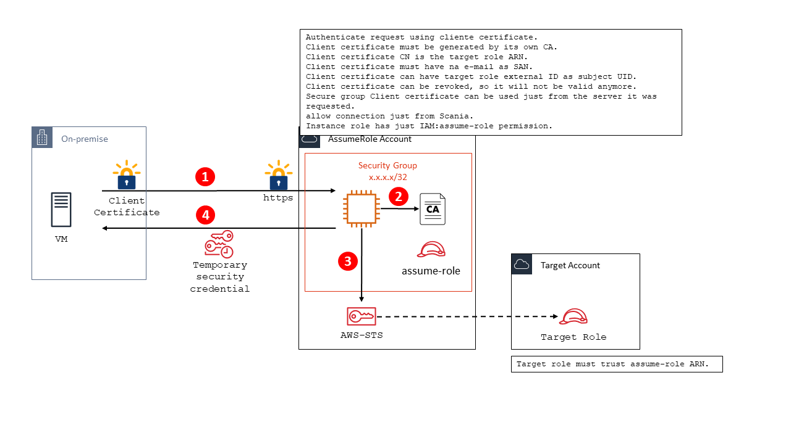

# AWS Assume Role

`aws-assume-role` is a web service to generate AWS STS token based on client certificate.  
Client certificate must have Extended Usage `ClientAuth`, also this certificate must be signed by some specific CA.  
The `CN` of the certificate must be the `Role ARN` to be assumed.

This service should be used to provied token to services running on-premise.  
You can consume this web service from any browser or any web request tool.

The idea is to run this service with some specific CA just for it.

## How it works



## Examples

```shell
curl --proxy "" --cert my-service.cer --key my-service.key https://localhost:8443/token/
```
